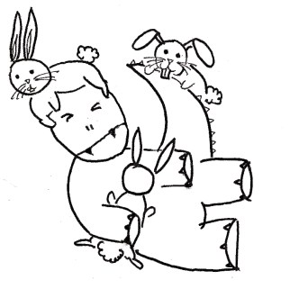
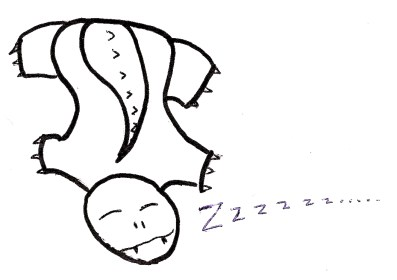

**Такая вот интересная сложность – Введение в алгоритмическую сложность**
=========================================================================

Оригинал - [*http://algosaur.us/algorithmic-complexity/*](http://algosaur.us/algorithmic-complexity/)
от [radhika](http://algosaur.us/author/radhika/)

**Неплохо знать что такое:**

-   Степень
-   Алгебра вообще
-   Функции и асимптоты
-   Сортировка вставками (на уровне алгоритма) и вообще сортировки

Этот пост можно грубо разделить на 3 части, так что можете выбрать сразу
любую, в зависимости от скилла:

-   [Юнлингам](#first)
-   [Падаванам](#second)
-   [Джедаям](#third)

<a name="first"></a>
Алгоритмическая сложность и рост функций составляют самую основу
алгоритмов. Они дают нам представление о том, насколько алгоритм быстрый
или медленный, так что вы не сможете разрабатывать и анализировать
алгоритмы, не зная про сложность.

{width="6.125in" height="3.736111111111111in"}

Алгозавру очень хочется узнать что такое “рост функции”. И для этого он
решил завести двух кроликов. А где два кролика, там... много кроликов.
Усредним количество потомства с каждой пары до четырёх (не будем
уточнять каким образом).

{width="6.692913385826771in"
height="4.152777777777778in"}

Если мы задумаем посчитать скорость роста количества кроликов, у нас
получится **2\^n**, где **n** - номер поколения. Это не очень хорошая
новость для Алгозавра, ибо сколь бы ни были кролики няшными - в какой-то
момент их будет **слишком** много.

{width="4.472222222222222in"
height="4.597222222222222in"}

Грубо говоря, сложность алгоритма разведения кроликов равна **O(2\^n)**.

{width="3.0845220909886266in"
height="2.5436745406824146in"}

Поскольку количество кролей в следующем поколении растёт экспоненциально
в зависимости от начального их количества (или, на языке алгоритма -
входных данных).

Давайте это разберём.

“Порядок роста времени работы алгоритма является простейшей
характеристикой эффективности алгоритма, и даёт возможность сравнить его
по сложности с другими алгоритмами” ([*Святое Евангелие
*](https://ru.wikipedia.org/wiki/%D0%90%D0%BB%D0%B3%D0%BE%D1%80%D0%B8%D1%82%D0%BC%D1%8B:_%D0%BF%D0%BE%D1%81%D1%82%D1%80%D0%BE%D0%B5%D0%BD%D0%B8%D0%B5_%D0%B8_%D0%B0%D0%BD%D0%B0%D0%BB%D0%B8%D0%B7)от
CLRS)

{width="6.692913385826771in"
height="3.4444444444444446in"}

([*для тех кто не в теме*](https://www.youtube.com/watch?v=Kbo7W5gSJEA))

Представим, что Алгозавр спускается вниз по очень странной лестнице с
**n** ступеньками. Чтобы спуститься вниз на одну ступеньку, он должен
пройти по ней **n** шагов горизонтально, и только потом вниз.

{width="3.1991054243219597in"
height="3.417678258967629in"}

Так что на каждой ступеньке он должен сделать **n** шагов. И для **n**
ступенек всего он должен пройти **n\^2** шагов.
```
def weirdStairs(nofStairs):
    steps = 0
    for i in range(0, nofStairs):
        steps += nofStairs
        steps += 1
    print steps
```
Сколько времени займёт весь спуск?

{width="5.844939851268592in"
height="3.1254188538932635in"}

<a name="second"></a>

Аналогично давайте рассмотрим сортировку вставкой.
```
def insertionSort(list):
    for i in range(1, len(list)):
        currentValue = list[i]
        position = index
        while position > 0 and list[position - 1] > currentValue:
            list[position] = list[position - 1]
        list[position] = currentValue
```
Предположим наихудший вариант - список отсортирован в обратном порядке,
т.е. каждая строчка кода в цикле выполнится для каждого элемента.

Как видно по коду, каждый элемент в списке передвинет все остальные
элементы.

Если длина списка - **n,** то эффективность не будет линейно
пропорциональна **n**, но будет пропорциональна **n в квадрате.**

Так что в худшем случае время работы алгоритма сортировки вставкой будет
примерно равно **O(n\^2),** где **О** - стандартное обозначение, а **n** - количество элементов в списке.

Для измерения эффективности нас интересует **только худший вариант**.

Пока что мы сортировали только списки из 10, максимум 100 элементов.
**Что, если их будет 1000? 1 000 000? Например количество пользователей
Вконтакте?**

Да, в таком случае алгоритмическая сложность действительно важна.В этих
примерах количество элементов настолько большое, что имеет значение
**только наивысшая степень**. Остальные числа не важны.

Приоритет порядков роста функции примерно
такой:

{width="4.054808617672791in"
height="6.42589457567804in"}

Грубо говоря, мы можем считать сложность алгоритма по одной только
структуре циклов в нём.

Проход по циклу даёт **O(n),** как и подсчёт его длины. Из чего следует,
что время работы пропорционально количеству элементов.
```
def traversal(list):
    for i in range(len(list)):
        print list[i]
```
Теперь Алгозавр знает достаточно много о росте функции, чтобы понять
какой алгоритм быстрее. Юпиии!

Если хотите понять анализ сложности ещё глубже - читайте дальше. Или
сварганьте кофейка, и возвращайтесь когда уляжется всё то, что вы уже
прочитали. Можете оставить закладку прямо тут.

<a name="third"></a>

Открыв CLRS на 43 странице, Алгозавр увидел…

{width="6.692913385826771in" height="4.125in"}

Давайте сперва выясним, что такое “асимптотическая
нотация”. Как вы возможно знаете, когда аргумент функции близится к
бесконечности, её значение приближается к некой линии, но никогда её не
касается. Эта линия называется
**асимптотой**.

{width="6.692913385826771in"
height="2.5972222222222223in"}

{width="6.166666666666667in"
height="2.625in"}

Вас это должно интересовать, поскольку разрабатывая алгоритм, Вам нужно
знать как он работает на **огромных числах.** Вы уже знаете про
О-нотацию: она показывает эффективность в самом худшем случае. Давайте
перейдём к **Ω**. Я опять возьму в качестве примера сортировку. Но
теперь входной список уже отсортирован как надо, т.е. это наилучший
случай работы алгоритма.
```
def insertionSort(someList):
    for i in range(1, len(someList)):
        currentValue = someList[i]
    position = i
    while position > 0 and someList[position - 1] > currentValue:
        someList[position] = someList[position - 1]
        position -= 1
        someList[position] = currentValue
    return someList
```
Мы всё равно должны пройти список один раз, даже если нам не придётся
заходить во вложенный цикл. Внешний цикл отработает **n** раз.

Так что в наилучшем случае сложность этого алгоритма - **Ω(n)**.

Чтобы понять что означают другие богом забытые символы, нам придётся
вспомнить алгебру...

Функции! И графики с ними!

Формально мы можем определить **Θ**, **O**, и **Ω** вот так:

{width="6.692913385826771in"
height="2.3194444444444446in"}

Если честно, понятнее не стало. Подключаем тяжёлую артиллерию: графики.
(срисованы с 45 страницы CLRS)

{width="6.692913385826771in"
height="5.652777777777778in"}

Несколько тонкостей. Эти функции должны быть монотонны на множестве
аргументов, начиная с n\_0.

Например **Ω(g(n))** определена только тогда, когда она меньше времени
работы (**c\*g(n)**) для всех n &gt; n\_0.

a\) Это график **Θ**. Он выглядит как котлета в гамбургере между двумя
функциями, что показывает, что **Θ(g(n))** определена только между
верхей и нижней границами. Попробуйте доказать.

b\) Это график **О**. Время работы функции всегда меньше **O(g(n))**, что
подтверждает, что **О** является верхней границей сложности. Хуже
эффективности быть не может.

c\) для **Ω**. The Время работы функции всегда больше **Ω(g(n))**, и это
лучший случай. Большей эффективности от алгоритма не ждите.

{width="6.402777777777778in"
height="2.7222222222222223in"}

Терпение, мой друг. Вот практический смысл всего этого:

1\. **Ω** полезен, когда нужно узнать самый быстрый вариант работы.

Ну, иногда это полезно.

2\. **О** покажет самый худший вариант работы алгоритма.

Вот это интересно всегда.

3\. Найти **Θ** сложнее чем **О**, так что **О** используют чаще.
Математики скажут что это не кошерно, но пусть считают его сами.

Фух, на этом всё с теорией.

{width="5.513888888888889in"
height="3.888888888888889in"}

Автор оригинала оставил адрес: rawrr@algosaur.us

**Литература:**

[*CLRS*](http://www.twirpx.com/file/1793684/)

[*Дасгупта С., Пападимитриу Х., Вазирани У.
Алгоритмы*](http://www.twirpx.com/file/1416654/).

[*Numbers: The Key to the Universe – Kjartan Poskitt
*](http://www.murderousmaths.co.uk/books/bkmm8.htm)(Пример про кроликов
взят оттуда)
