**Pixel Mixing**
=========================================================================

Оригинал - [http://entropymine.com/imageworsener/pixelmixing](http://entropymine.com/imageworsener/pixelmixing/)

В этой статье мы рассмотрим простой алгоритм сжатия изображений. У него нет стандартизированного имени, его называют *pixel mixing*, *pixel averaging* или *area map*. Будем в рамках статьи использовать название *pixel mixing*.

Он очень похож на линейную интерполяцию или *box filtering*, но не совсем.

Алгоритм очень простой для понимания. Начнём с оригинального изображения 8×8:

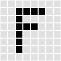{width="2.125in" height="1.736111111111111in"}

Забудем про сетку 8х8, и наложим поверх изображения новую, того размера, к которому нам нужно сжать изображение:

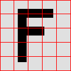{width="2.125in" height="1.736111111111111in"}

Каждому пикселю новой сетки присвоим цвет, равный размеру закрашенной области внутри нового пикселя:

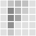{width="2.125in" height="1.736111111111111in"}

И алгоритм на этом завершён.
Увеличение работает точно так же:

{width="2.125in" height="1.736111111111111in"}

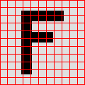{width="2.125in" height="1.736111111111111in"}

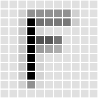{width="2.125in" height="1.736111111111111in"}

**Плюсы:**

- Простой, лёгкий для понимания и реализации;
- Отображает почти то же, что вы видите приближаясь или удаляясь относительно объекта;
- Относительно быстрый;
- Сохраняет общую яркость изображения абсолютно такой же;
- Довольно хорошее качество при уменьшении или небольшом увеличении размера;
- Работает с любыми изображениями, даже случайным набором цветных пикселей. Большинство алгоритмов считают смежные пиксели зависимыми друг от друга. Pixel mixing такую зависимость не учитывает.

**Минусы:**

- Плохо подходит для большого увеличения размера, поскольку сильно пикселизирует изображение;
- Вызывает довольно сильный алиасинг, для изображений с мелкими деталями может вызывать муар;
- Не выполняет анти-алиасинг;
- Обрабатывает пиксели как *маленькие квадраты*, что не всегда так.

**Алиасинг**

При уменьшении изображения pixel mixing имеет проблему, так называемый *алиасинг*.
Если мы сильно уменьшим размер изображения ниже, некоторые чёрные и белые аркс будут слишком мелкими:

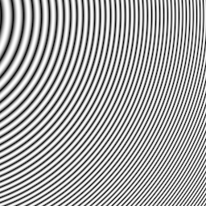{width="6.125in" height="3.736111111111111in"}

Самое лучшее, что можно сделать в такой ситуации - использовать сплошной усреднённый цвет. Поэтому чем дальше мы двигаемся от левого верхнего угла, тем тоньше становятся линии, и некоторые точки сливаются в сплошной цвет, примерно так:

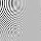{width="6.125in" height="3.736111111111111in"}

Но с pixel mixingом, когда линии совсем тонкие, мы видим совсем неожиданные артефакты:

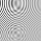{width="6.125in" height="3.736111111111111in"}

Большинство реальных изображений этому не подвержены, но проблема существует.
Вот похожая проблема. Если в исходном изображении есть резкие изкажения, как тут:

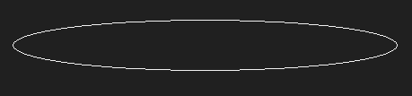{width="6.125in" height="3.736111111111111in"}

Pixel mixing очень плохо анти-алиасит его:

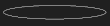{width="6.125in" height="3.736111111111111in"}

Большинство алгоритмов, например Ланцоша, делает это намного лучше:

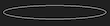{width="6.125in" height="3.736111111111111in"}

**Связь с box filter**

Если увеличивать изображение в целое число раз, pixel mixing делает абсолютно то же, что box filter. В других случаях - нет.

Box filter использует виртуальную сетку, как и pixel mixing, но вместо полного покрытия исходным цветом нового пикселя, цвет в box filter сохраняется только в центре.

Или, смотря с другой стороны, сетка в box filter может накладываться только поверх исходной сетки, и не может пересекать её пиксели.

(Аналогия с сеткой становится не такой точной если рассматривать увеличение изображения. Но алгоритм работает так же.)

**Приведение box filter к pixel mixing**

Есть несколько способов использовать box filter с результатом, почти совпадающим с pixel mixing:

- Использовать метод ближайшего соседа или box filter для увеличения изображения в фиксированное число раз. Чем выше число, тем похоже результат.
- Использовать box filter для уменьшения изображения до нужного размера

Такой алгоритм может оказаться быстрее чем pixel mixing.

**Функция фильтра**

Pixel mixing может быть реализован через типичный filter-based алгоритм, но форма фильтра должна быть адаптирована под коэффициент увеличения.

Анализируя pixel mixing с помощью [ResampleScope](http://entropymine.com/resamplescope/) или подобных утилит, для больших увеличений мы видим результат, похожий на box filter:

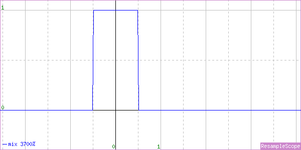{width="6.125in" height="3.736111111111111in"}

Но для мелких график выглядит по-другому. Вот, например, для увеличения в 2 раза:

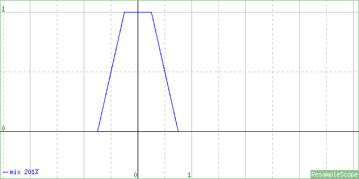{width="6.125in" height="3.736111111111111in"}

*(Замечу, что для получения хорошего графика, лучше не использовать факторы увеличения с целыми или десятичными дробями (например 2, 1/2, или 3/5). Они могут привести к вырождению графика в несколько изолированных точек. По той же причине разные фильтры могут выдать одинаковый результат: учитываются только точки, в которых функции равны.)*

С приближением коэффициента увеличения к единице, фильтр всё больше и больше отличается от box filter, и приближается к треугольному:

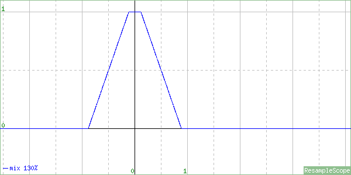{width="6.125in" height="3.736111111111111in"}

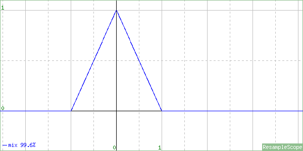{width="6.125in" height="3.736111111111111in"}

При пересечении коэффициентом единицы, приближение к box filter возрастает. Фильтр для коэффициента N выглядит так же, как для 1/N.

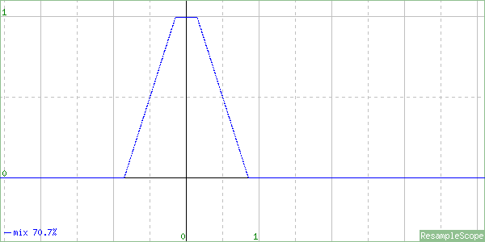{width="6.125in" height="3.736111111111111in"}

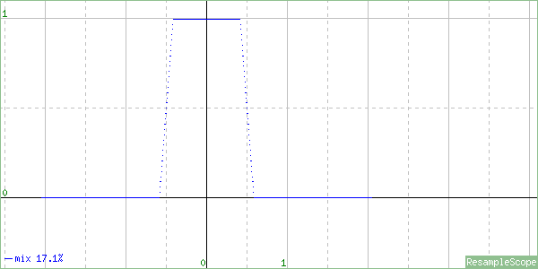{width="6.125in" height="3.736111111111111in"}

Объединив результаты, мы можем реализовать pixel mixing в виде фильтр-функции, примерно таким образом:

```
function pixel_mix_filter(scale_factor, x)
{
    if scale_factor < 1
       p:= scale_factor
    else
       p:= 1/scale_factor

    if x < 0.5-p/2
        return 1
    else if x < 0.5+p/2
        return 0.5-(x-0.5)/p
    else
        return 0
}
```

**Представление в виде интеграла**

Ещё один способ представления pixel mixing - в виде интеграла функции ближайшего соседа.
Для примера, рассмотрим уменьшение чёрно-белого изображения из 8×1 в 5×1.
Отрисуем функцию яркости блишайшего к каждой точке пикселя:

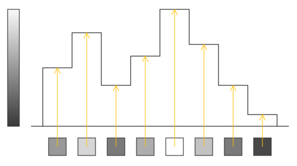{width="6.125in" height="3.736111111111111in"}

Разделим область под графиком до оси Х на 5 равных секций:

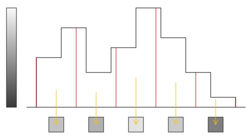{width="6.125in" height="3.736111111111111in"}

Если бы мы использовали стандартный алгоритм сжатия, мы бы могли просто "сжать" функцию, найдя значения на оси Х, соответствующие центрам пикселей исходного изображения.

Вместо этого, нам нужно вычислить **область** каждой секции. Область отображает относительную яркость пикселей в сжатом изображении. Если вы немного знаете математику, вы знаете что такая область выражается *интегралом*
Эта техника (интегрирование вместо дискретного сжатия) может быть использована и в других функциях, но если изображение не обладает определёнными свойствами, сжатие может его размыть.